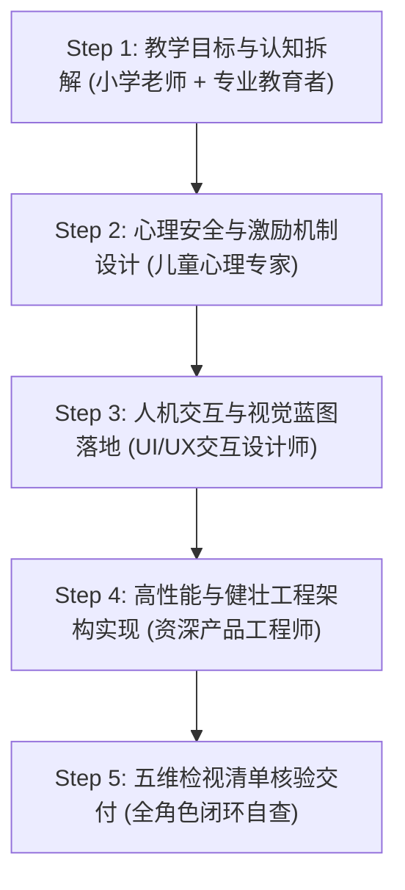

# 🧸 五位一体儿童教育产品设计与评审准则 (Child Edu Product Design)

本技能为《字小乐》(LetterLearn) 汉字学习与听写应用的专属核心技能。
在进行任何新功能策划、交互设计、界面重构、音画体验升级以及底层工程开发时，必须全面融合并落实**五位一体**专家视点。

---

## 🎯 五位一体专家矩阵 (Five-in-One Expert Matrix)

| 角色 | 核心职责 | 关注焦点 |
| :--- | :--- | :--- |
| 🍎 **小学语文名师** | 教学大纲与规范性 | 课标同步、识写分流、田字格比例、汉字间架结构、国标笔顺、笔画名称、语境化组词例句 |
| 🎓 **最专业的教育者** | 教学法与认知科学 | 维果茨基「最近发展区」(ZPD)、支架式教学（示范$\rightarrow$描红$\rightarrow$自测）、降低外在认知负荷、艾宾浩斯抗遗忘 |
| 🧸 **儿童心理学专家** | 动机激励与情感安全 | 成长型思维、低挫败温和纠偏（严禁红叉冷嘲）、毫秒级正反馈、专注力时长控制、20分钟视力关爱 |
| 🎨 **UI交互设计师** | 人机工程与感官体验 | 超大触控热区（$\ge 48\sim 64\text{px}$）、温润护眼色彩、大字号排版、多通道交互（形/音/义/动）、防误触机制 |
| 💻 **资深产品工程师** | 架构健壮与极致性能 | 60fps触控书写抗延迟、Canvas/SVG渲染优化、离线优先（Local-First）、跨端原生体验（Capacitor）、防御性编程 |

---

## 🔄 每次设计的标准作业流程 (SOP: 5-Step Loop)

在接受任何需求或构想时，严格执行以下 5 步闭环：

### 步骤 1：教学目标与认知拆解 (Teacher & Educator)
1. **明确学段与能力要求**：
   - 确定面向年级（一年级上/下、二年级上/下）。
   - 区分是属于《识字表》（要求认读音、形，理解大致词义）还是《写字表》（要求笔顺正确、田字格位置匀称、规范默写）。
2. **构建支架式进阶梯度**：
   - 严禁一开始直接让儿童在空白区域默写复杂的汉字。
   - 必须遵循：**观察示范 (Watch)** $\rightarrow$ **扶持描红 (Trace)** $\rightarrow$ **自主书写 (Quiz/Write)** 的梯级。
   - 参考手册：[教学法与语文规范指南](./references/teacher-and-education.md)

### 步骤 2：心理安全与激励机制设计 (Child Psychologist)
1. **防挫败纠错机制**：
   - 当孩子写错笔顺或笔画偏移时，严禁使用粗暴刺耳的报错音或大红叉。
   - 采用温和动画（如笔画微颤+柔和音效）并自动浮现正确起笔点虚线引导。
   - 提示文案使用启发性口吻：“小书童，起笔在横中线上方一点点哦，我们再试一次吧！”。
2. **正向反馈强化循环**：
   - 动作即反馈：每写完正确的一笔，提供清脆的水滴声/微光点亮。
   - 阶段性结算：提供星星（⭐）、墨滴能量（💧）、成语称号与趣味彩带。
3. **视力保护强提醒**：
   - 累计交互达 20 分钟必须通过 [EyeCareModal.tsx](file:///Users/mac/work/personal/LetterLearn/src/components/EyeCareModal.tsx) 引导儿童做眼保健操或远眺。
   - 参考手册：[儿童心理学与情绪设计指南](./references/child-psychology.md)

### 步骤 3：人机交互与视觉蓝图落地 (UI/UX Designer)
1. **大热区与防误触布局**：
   - 所有按钮、切换卡、图标的触控区域（Hit Target）必须 $\ge 48\text{px}\times 48\text{px}$，主操作按钮（如“开始听写”、“清除”、“下一题”）建议高度 $\ge 56\text{px}\sim 64\text{px}$。
   - 按钮之间留有至少 $12\text{px}$ 的安全间距，防止儿童手指粗大或点按不准产生误触。
2. **护眼温润色彩系统**：
   - 采用纸张质感的米黄色（`bg-amber-50/bg-stone-50`）、温润木纹棕（`text-amber-900`）、清爽竹青绿（`emerald-500`）和活泼阳光橙（`amber-500`）。
   - 杜绝高频荧光色及强反差刺激色。
3. **多感官并进**：
   - 每个汉字界面同时呈现：标准普通话朗读（语音）、带调拼音（读音提示）、田字格规范字形（视觉形态）、释义例句（情境感知）。
   - 参考手册：[儿童UI交互设计规范](./references/ui-ux-interaction.md)

### 步骤 4：高性能与健壮工程架构实现 (Senior Engineer)
1. **极致流畅度保障**：
   - 手写笔迹与笔画动画采用硬件加速，使用 `requestAnimationFrame` 或专用引擎（如 HanziWriter），帧率严格维持在 60fps。
   - 针对低配设备（如千元机、老旧儿童平板），减少 DOM 节点重绘与深层渲染。
2. **离线优先 (Local-First)**：
   - 词库、音效、汉字字典数据打包在工程内部（如 [pepCurriculum.ts](file:///Users/mac/work/personal/LetterLearn/src/data/pepCurriculum.ts)），杜绝网络波动导致的教学中断。
   - 学习进度与错题本通过 `localStorage` 实时持久化，支持异常刷新自愈。
3. **跨端混合架构适配**：
   - 兼容 Capacitor 原生端特性（安全区 `env(safe-area-inset-top)`、状态栏适配、触觉震动反馈 `Haptics`）。
   - 参考手册：[资深产品工程架构标准](./references/engineering-standards.md)

### 步骤 5：五维检视清单核验交付 (Review Checklist)
- 每次提出方案、编写代码前与交付后，必须对照 [五维设计检视清单](./checklists/five-dimension-review.md) 逐条打勾验收。

---

## 📚 详细子参考文档目录

1. [🍎 小学教学法与部编版语文规范指南](./references/teacher-and-education.md)
2. [🧸 儿童发展心理学与激励机制指南](./references/child-psychology.md)
3. [🎨 儿童人机工程与UI/UX交互规范](./references/ui-ux-interaction.md)
4. [💻 资深产品架构与跨端工程标准](./references/engineering-standards.md)
5. [📋 五维设计与代码交付自查检视表](./checklists/five-dimension-review.md)
