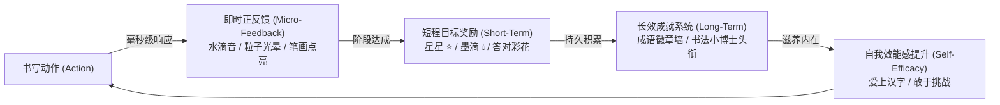

# 🧸 儿童发展心理学与激励机制指南

> **主理角色**：儿童心理学专家、最懂儿童的教育者  
> **适用受众**：5 ~ 10 岁学龄前及小学一至三年级儿童  
> **核心原则**：心理安全、成长型思维、毫秒级正反馈、挫败免疫、健康关怀

---

## 一、5~10岁儿童发展心理学特征

### 1. 注意力跨度 (Attention Span) 与意志品质
* **生理特点**：脑神经发育尚在成熟期，注意力以无意注意为主，有意注意时间短：
  * 5~6岁（幼小衔接）：有效专注时间约 **10~15 分钟**。
  * 7~8岁（一二年级）：有效专注时间约 **15~20 分钟**。
  * 9~10岁（三四年级）：有效专注时间约 **20~25 分钟**。
* **产品应对策略**：
  * **切分微任务**：一课练习控制在 5~8 个生字以内，每个生字练习控制在 2 分钟以内。
  * **20 分钟护眼与呼吸律动**：通过 [EyeCareModal.tsx](file:///Users/mac/work/personal/LetterLearn/src/components/EyeCareModal.tsx) 强制或温和引导儿童休息眼睛、活动手腕。

### 2. 挫败耐受度 (Frustration Tolerance) 极低
* **心理特点**：儿童容易把“任务未达成”等同于“自己笨/被否定”，频繁的报错声、血红色的“×”或降级惩罚会直接引发焦虑、厌学与逃避情绪。
* **防挫败“软着陆”纠偏原则**：
  * ❌ **绝对禁止**：严厉的警报音、刺眼的红叉（❌）、扣分、冷嘲讽提示（如“真笨”、“又错了”）。
  * ✅ **必须采用**：
    1. **弹性容差**：儿童手部精细肌肉发育不成熟，握笔颤抖是正常现象，笔迹匹配算法必须预留合理容差半径（Tolerance Margin）。
    2. **温和引导**：笔顺错误时，原位轻微晃动提示，并以柔和光点演示正确的下一笔起笔与方向。
    3. **鼓励式反馈话术**：
       - “哇，这一笔力道真棒！下一笔从这里起笔试试看～”
       - “差一点点就完美了，我们再来一次好不好？”
       - “这一个字结构好工整，你真有写书法的天赋！”

### 3. 精细运动技能 (Fine Motor Skills) 的发育阶段
* 5~8岁儿童手指小肌肉群未发育完全，握持电容笔或使用手指触控时，常出现控笔不稳、划线过快或手指遮挡屏幕视线的情况。
* **交互保障**：田字格空间要宽敞，笔画触控感应区域要有防手部误贴（Palm Rejection / 触点防粘连）设计。

---

## 二、正向强化与游戏化内驱力体系

### 1. 毫秒级即时微反馈 (Immediate Micro-Feedback)
* **听觉**：每次下笔与收笔伴随清脆自然的声响（清脆的竹筒声、露珠滴落水声），成功写对一笔发出温润的叮咚声。
* **视觉**：笔尖划过带有微光墨痕动效，写对后笔画转为饱满墨色并产生轻微光泽闪烁。

### 2. 成长型思维激励 (Growth Mindset Architecture)
* 鼓励重点在于**努力过程与进步**，而非天赋：
  * “你今天比昨天多掌握了 3 个生字！”
  * “消灭了错题本里的 2 只‘小怪兽’，太了不起了！”
* 积分体系设计：
  * **星星 (⭐)**：代表字形美观与正确率。
  * **墨滴 (💧)**：代表练习时长与坚持次数（即使写错重练，也能获得墨滴，奖励每一次付出）。

### 3. 儿童视力关怀与健康底线 (Physical Well-being)
* 护眼功能绝不仅是摆设，而是产品的核心伦理底线。
* 支持防沉迷软锁，单次使用达 20 分钟主动提示休息，并提供动画引导做远眺操与眨眼操。
